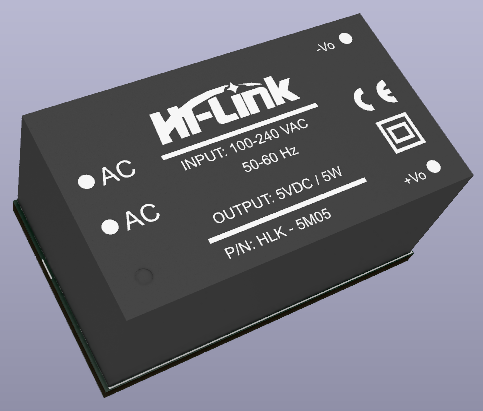
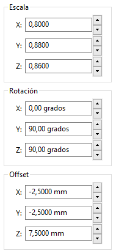

**Cool Hi-Link HLK5 model**

| **Valores de ajuste en el KiCad** |
|---|
|Escala:|
  |- X: 0.8|
  |- Y: 0.88|
  |- Z: 0.86|
   
Rotación
  - X: 00.0
  - Y: 90.0
  - Z: 90.0
  - 
Offset
  - X: -2.5
  - Y: -2.5
  - Z: 7.5

